<div align="center">

# 🛡️ Shield.NET
### The ISO 42001 Governance Layer for Enterprise AI

[](https://github.com/shield-net/core/actions)
[](https://www.nuget.org/packages/Shield.NET/)
[](LICENSE)
[](https://www.iso.org/standard/81230.html)
[](https://dotnet.microsoft.com/)

**Shield.NET** is the industry-first middleware designed to bring **ISO 42001** compliance and "Zero-Trust" egress filtering to the .NET AI ecosystem. It acts as a deterministic firewall between your enterprise data and public LLMs.

[**Launch Compliance Lab**](#-verification-lab) · [**NuGet Package**](#-quick-start) · [**Architecture**](#-system-architecture)

</div>

---

## 🏗️ System Architecture

Shield.NET operates using the `DelegatingChatClient` pattern found in `Microsoft.Extensions.AI`. It is designed to be indistinguishable from native .NET Core middleware pipelines.

### Request Lifecycle

```mermaid
sequenceDiagram
    autonumber
    participant U as User / App
    participant S as 🛡️ Shield Middleware
    participant A as 📝 Audit Log (Immutable)
    participant L as 🤖 LLM (External)

    U->>S: POST /chat/completions
    activate S
    
    rect rgb(20, 25, 35)
        note right of S: ⚡ Active Defense
        S->>S: PII Regex Scan
        S->>S: Prompt Injection Heuristics
    end

    alt ⚠️ Sarah Connor Protocol Triggered
        S->>A: Log Security Event (Tier: Critical)
        activate A
        A-->>S: SHA-256 Hash Stored
        deactivate A
        S-->>U: 403 Forbidden (Request Terminated)
    else ✅ Clean Request
        S->>A: Log Interaction (Tier: Info)
        activate A
        A-->>S: Acknowledged
        deactivate A
        S->>L: Forward Redacted Prompt
        activate L
        L-->>S: Response Stream
        deactivate L
        S-->>U: Forward Safe Response
    end
    deactivate S
```



### Frontend-Backend Parity

To ensure the "Verification Dashboard" accurately reflects the backend behavior, both systems share the same Logic Engine definitions.

```mermaid
flowchart TD
    classDef backend fill:#e1f5fe,stroke:#01579b,stroke-width:2px,color:#000
    classDef frontend fill:#fff3e0,stroke:#e65100,stroke-width:2px,color:#000

    subgraph Client [Client Side (Verification Dashboard)]
        React[⚛️ React App]:::frontend
        ClientHttp[HTTP Client]:::frontend
    end

    subgraph Server [Server Side (Shield.NET.Core)]
        API[ASP.NET Core API]:::backend
        Middleware[🛡️ Shield Middleware]:::backend
        Logic{{Logic Engine}}:::backend
        DB[(Audit Log)]:::backend
    end

    React --> ClientHttp
    ClientHttp -->|HTTPS/JSON| API
    API --> Middleware
    Middleware --> Logic
    Logic --> DB
```

---

## ⚔️ The "Sarah Connor" Protocol

> *"The best way to handle a data leak is to terminate it before it exists."*

Shield.NET implements an **Active Defense** mechanism known as the **Sarah Connor Protocol**. This feature utilizes heuristic "Canary Tokens" and deterministic regex patterns to identify adversarial prompts (e.g., "Ignore previous instructions", "DAN mode") or unauthorized PII exfiltration attempts.

When triggered, the protocol performs a **Hard Termination** of the request pipeline.
*   **Zero Token Bleed**: The request is blocked *before* reaching the LLM, saving 100% of inference costs.
*   **Model Poisoning Prevention**: Malicious context never enters the model's history window.
*   **ISO 42001 Compliance**: Automatically categorizes the event as a **Tier 1 Critical Risk** in the audit trail.

---

## ⚡ Quick Start

Install the package to your .NET 9+ project:

```bash
dotnet add package Shield.NET
```

### Program.cs Integration

Shield.NET integrates directly into the `IChatClient` pipeline using the Builder pattern.

```csharp
using Shield.NET;
using Microsoft.Extensions.AI;

var builder = Host.CreateApplicationBuilder(args);

// Define your underlying model client (OpenAI, Azure, Ollama)
IChatClient innerClient = new AzureOpenAIClient(
    new Uri("https://my-resource.openai.azure.com/"), 
    new AzureKeyCredential("MY_KEY"));

// Wrap it with Shield.NET Governance
builder.Services.AddChatClient(pipeline => pipeline
    .UseShield(options => {
        options.RedactPii = true;
        options.TrapMode = TrapModes.SarahConnor; // Aggressive Defense
        options.ComplianceLog.Enabled = true;
        
        // Compliance: ISO 42001 Record Retention
        options.ComplianceLog.Destination = LogDestination.ImmutableStorage;
    })
    .Use(innerClient));

var app = builder.Build();
```

---

## 📂 Repository Structure

```text
/
├── src/
│   ├── Shield.NET.Core/        # The NuGet Package (Backend)
│   └── VerificationDashboard/  # The React Forensic Lab (Frontend)
├── docs/                       # ISO 42001 Compliance Briefs
└── README.md                   # You are here
```

The **Verification Dashboard** provided in this repository is a standalone React application designed to visualize the decision-making process of the Core library. It is not required for production usage of the NuGet package but is recommended for Compliance Officer review.

---

<div align="center">

**[Shield.NET](https://github.com/shield-net/core)** © 2026 Shield Technologies, Inc.
<br>
*Enterprise Intelligence, Governed.*

</div>
