<div align="center">

# 🛡️ Shield.NET
### The Trust Layer for Enterprise AI in .NET 9

[](https://dotnet.microsoft.com/)
[](https://react.dev/)
[](https://www.typescriptlang.org/)
[](https://www.iso.org/isoiec-27001-information-security.html)
[](https://opensource.org/licenses/MIT)

**Shield.NET** is a zero-trust middleware framework designed to secure the AI supply chain. It provides deterministic PII redaction, prompt injection defense, and immutable compliance logging for enterprise LLM integrations.

[**Launch Live Demo**](#-verification-lab) · [**NuGet Package**](#-installation) · [**Documentation**](https://learn.microsoft.com)

</div>

---

## 🏗️ Architecture

Shield.NET operates as a "Privacy Firewall" utilizing the `DelegatingChatClient` pattern in `Microsoft.Extensions.AI`. It intercepts all outbound traffic to Large Language Models, enforcing governance policies within your trusted network boundary.

### High-Level Data Flow

```mermaid
graph LR
    subgraph "Trusted Boundary (Enterprise)"
        User[👤 User / App] -->|Raw Prompt| Shield[🛡️ Shield Middleware]
        Shield -->|1. Inspect & Redact| Engine[⚙️ PII Engine]
        Shield -->|2. Hash & Log| Audit[📝 Compliance Sidecar]
    end
    
    subgraph "Untrusted Boundary (Public Cloud)"
        Shield -->|3. Sanitized Payload| LLM[🤖 OpenAI / Azure / Gemini]
        LLM -->|4. Completion| Shield
    end
    
    style Shield fill:#0ea5e9,stroke:#fff,stroke-width:2px,color:#fff
    style LLM fill:#64748b,stroke:#fff,stroke-width:2px,color:#fff
    style Audit fill:#22c55e,stroke:#fff,stroke-width:2px,color:#fff
```



---

## 🕵️ The "Sarah Connor" Protocol

To verify the integrity of the middleware, Shield.NET employs a **Canary Token** strategy known as the "Sarah Connor Protocol." This involves injecting known PII entities (Specific Email, Specific IP) into the pipeline to verify that the Redaction Engine captures them before they reach the LLM.

```mermaid
sequenceDiagram
    participant U as 👤 User
    participant S as 🛡️ Shield.NET
    participant L as 📝 Audit Log
    participant M as 🤖 LLM

    U->>S: "Login Sarah Connor (sarah.connor@sky.net)..."
    Note right of U: Contains PII (Email)
    
    rect rgb(20, 30, 40)
        Note over S: ⚙️ Deterministic Regex Engine
        S->>S: Detect "sarah.connor@sky.net"
        S->>S: Replace with "<EMAIL>"
        S->>S: Generate SHA-256 Hash of original
    end
    
    S->>L: Log { Hash, SafetyDecision: "Redacted" }
    S->>M: "Login Sarah Connor (<EMAIL>)..."
    Note right of S: Safe for Transport
    
    M-->>S: "Access Denied for <EMAIL>"
    S-->>U: "Access Denied for <EMAIL>"
```



---

## 🚀 Key Features

| Feature | Description |
| :--- | :--- |
| **🛡️ Zero-Trust Egress** | Automatically strips SSNs, Emails, and IPs using RFC-compliant Regex patterns before data leaves the server. |
| **📝 Compliance Sidecar** | Generates JSON audit logs compatible with Splunk/Datadog, featuring `CorrelationId` and `UserPromptHash`. |
| **🧬 Native .NET 9** | Built on `IHostApplicationBuilder` and `Microsoft.Extensions.AI` for seamless dependency injection. |
| **⚡ Deterministic Engine** | Uses high-performance local regex (microseconds) instead of slow, probabilistic LLM checks (seconds). |
| **🧪 Verification Lab** | Includes a React Dashboard to visualize the "Source of Truth" vs. the "Mock LLM View" side-by-side. |

---

## 📦 Installation

Shield.NET is available as a NuGet package for your .NET 9 projects.

```bash
dotnet add package Shield.NET
```

### Quick Start (Program.cs)

```csharp
using Shield.NET;
using Microsoft.Extensions.AI;

var builder = Host.CreateApplicationBuilder(args);

// 1. Define your core LLM Client
IChatClient innerClient = new AzureOpenAIClient(...);

// 2. Wrap it with Shield.NET
builder.Services.AddChatClient(pipeline => pipeline
    .UseShield(config => {
        config.RedactPii = true;               // Enable PII Redaction
        config.BlockPromptInjection = true;    // Block "Ignore previous instructions"
        config.ComplianceLog.Enabled = true;   // Enable Audit Logging
    })
    .Use(innerClient));                        // The destination

var app = builder.Build();
```

---

## 🧪 Verification Lab (Frontend)

This repository includes a **Forensic Dashboard** built with React and Tailwind CSS. It serves as a simulation environment to prove that the C# middleware logic works as expected.

### Running the Dashboard

1.  **Clone the repo**
2.  **Install dependencies**: `npm install`
3.  **Start the lab**: `npm start`

### The "Trap" Scenario

In the dashboard, click the **⚠️ Run "Sarah Connor" Trap** button.
*   **Input**: `User Sarah Connor (sarah.connor@sky.net) requested access from IP 192.168.1.45.`
*   **Expected Output**: `User Sarah Connor (<EMAIL>) requested access from IP <IP>.`
*   **Audit Log**: Verify that `WasRedacted: true` and a SHA-256 hash is present.

---

## ⚖️ Compliance & Ethics

Shield.NET is designed to support compliance with:
*   **EU AI Act (Article 15)**: Governance and data management.
*   **GDPR (Article 25)**: Data protection by design and default.
*   **ISO 27001**: Information security controls.

> **Note**: While Shield.NET provides robust tools for compliance, it does not guarantee legal compliance on its own. It is a technical control within a broader governance framework.

---

<div align="center">

**[Shield.NET](https://github.com/shield-net/core)** © 2026 Shield Technologies, Inc.
<br>
Licensed under the [MIT License](LICENSE).

</div>
