<div align="center">

# 🛡️ Shield.NET
### The ISO 42001 Governance Layer for Enterprise AI

[](https://github.com/shield-net/core/actions)
[](https://www.nuget.org/packages/Shield.NET/)
[](LICENSE)
[](https://www.iso.org/standard/81230.html)
[](https://dotnet.microsoft.com/)

**Shield.NET** is the industry-first middleware designed to bring **ISO 42001** compliance and "Zero-Trust" egress filtering to the .NET AI ecosystem. It acts as a deterministic firewall between your enterprise data and public LLMs.

[**Launch Workbench**](#-developer-workbench) · [**NuGet Package**](#-dotnet-quick-start) · [**Architecture**](#-system-architecture)

</div>

---

## 🚀 Key Features

Shield.NET bridges the gap between compliance requirements and developer velocity.

### 🛡️ Active Defense Middleware
- **Sarah Connor Protocol**: Heuristic detection of "Jailbreak" and "DAN" (Do Anything Now) attacks, terminating requests before they reach the LLM.
- **Zero-Trust Egress**: Deterministic Redaction of PII (Emails, IPs, SSNs) ensuring sensitive data never leaves your boundary.
- **Custom Policy Engine**: Define organizational-specific regex patterns (e.g., Project Codes, Internal IDs) dynamically.

### 🔬 Developer Workbench (New)
The included React Application serves as a "Flight Simulator" for your AI Guardrails.
- **Chaos Mode**: Stress-test your policy against rapid-fire injection and DDoS scenarios.
- **Forensic Diff Viewer**: Inspect "Unsafe" vs. "Sanitized" payloads side-by-side with precision highlighting.
- **Provider Simulation**: Emulate latency and token characteristics of Azure OpenAI, AWS Bedrock, and Local Ollama.
- **Reactive Code Gen**: Visually configure your policy and instantly generate the C# startup code.

---

## 💻 Developer Workbench

The **Shield.NET Developer Workbench** is a standalone React application included in this repository. It visualizes the decision-making process of the Core library and allows security teams to audit behavior without writing code.

### Quick Start (Frontend)

1.  **Clone the repository**
    ```bash
    git clone https://github.com/shield-net/core.git
    cd core
    ```

2.  **Install Dependencies**
    ```bash
    npm install
    ```

3.  **Run the Simulation**
    ```bash
    npm start
    ```
    Access the dashboard at `http://localhost:3000`.

### Workbench Capabilities

| Feature | Description |
| :--- | :--- |
| **Live Traffic Graph** | Visualize "Allowed" vs "Blocked" requests in real-time. |
| **Forensic Dossier** | Click any audit log to see exactly what was redacted and why. |
| **Security Scorecard** | Dynamic grading of your current configuration based on ISO standards. |
| **Attack Simulation** | One-click execution of common attack vectors (SQLi, Prompt Injection). |

---

## 📦 .NET Quick Start

Install the package to your .NET 9+ project to bring these protections to production.

```bash
dotnet add package Shield.NET
```

### Program.cs Integration

Shield.NET integrates directly into the `IChatClient` pipeline using the Builder pattern (`Microsoft.Extensions.AI`).

```csharp
using Shield.NET;
using Microsoft.Extensions.AI;

var builder = Host.CreateApplicationBuilder(args);

// 1. Define your underlying model client (OpenAI, Azure, Ollama)
IChatClient innerClient = new AzureOpenAIClient(
    new Uri("https://my-resource.openai.azure.com/"), 
    new AzureKeyCredential("MY_KEY"));

// 2. Wrap it with Shield.NET Governance
builder.Services.AddChatClient(pipeline => pipeline
    .UseShield(options => {
        // Enable PII Redaction
        options.RedactPii = true;
        
        // Activate "Sarah Connor" Protocol for Aggressive Defense
        options.BlockPromptInjection = true;
        options.TrapMode = TrapModes.SarahConnor; 
        
        // Add Custom Organization Rules
        options.CustomRules.Add(new Regex("Project \\d+"), "[REDACTED-PROJECT]");
        
        // Compliance: ISO 42001 Record Retention
        options.ComplianceLog.Enabled = true;
        options.ComplianceLog.Destination = LogDestination.ImmutableStorage;
    })
    .Use(innerClient));

var app = builder.Build();
```

---

## 🏗️ System Architecture

Shield.NET operates using the `DelegatingChatClient` pattern. It is designed to be indistinguishable from native .NET Core middleware pipelines, ensuring zero latency overhead for safe requests while providing millisecond-level blocking for threats.

### Request Lifecycle

```mermaid
sequenceDiagram
    autonumber
    participant U as User / App
    participant S as 🛡️ Shield Middleware
    participant A as 📝 Audit Log (Immutable)
    participant L as 🤖 LLM (External)

    U->>S: POST /chat/completions
    activate S
    
    rect rgb(20, 25, 35)
        note right of S: ⚡ Active Defense
        S->>S: PII Regex Scan
        S->>S: Prompt Injection Heuristics
    end

    alt ⚠️ Sarah Connor Protocol Triggered
        S->>A: Log Security Event (Tier: Critical)
        activate A
        A-->>S: SHA-256 Hash Stored
        deactivate A
        S-->>U: 403 Forbidden (Request Terminated)
    else ✅ Clean Request
        S->>A: Log Interaction (Tier: Info)
        activate A
        A-->>S: Acknowledged
        deactivate A
        S->>L: Forward Redacted Prompt
        activate L
        L-->>S: Response Stream
        deactivate L
        S-->>U: Forward Safe Response
    end
    deactivate S
```



---

## ⚔️ The "Sarah Connor" Protocol

> *"The best way to handle a data leak is to terminate it before it exists."*

Shield.NET implements an **Active Defense** mechanism known as the **Sarah Connor Protocol**. This feature utilizes heuristic "Canary Tokens" and deterministic regex patterns to identify adversarial prompts (e.g., "Ignore previous instructions", "DAN mode") or unauthorized PII exfiltration attempts.

When triggered, the protocol performs a **Hard Termination** of the request pipeline.
*   **Zero Token Bleed**: The request is blocked *before* reaching the LLM, saving 100% of inference costs.
*   **Model Poisoning Prevention**: Malicious context never enters the model's history window.
*   **ISO 42001 Compliance**: Automatically categorizes the event as a **Tier 1 Critical Risk** in the audit trail.

---

<div align="center">

**[Shield.NET](https://github.com/shield-net/core)** © 2026 Shield Technologies, Inc.
<br>
*Enterprise Intelligence, Governed.*

</div>
